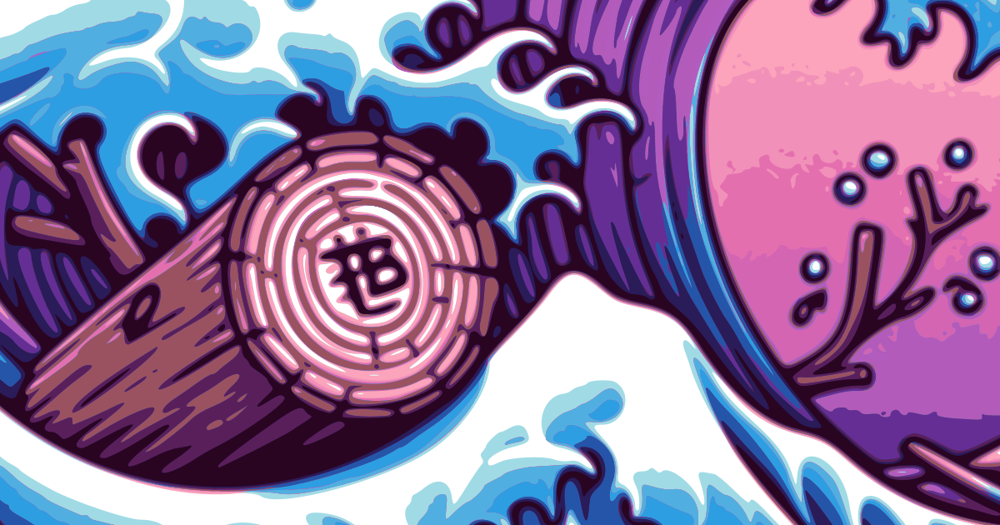

#  TEST-BLOG
[](https://ibrahimtanyalcin.github.io/test-blog/)

A blog template that can be used w/o GitHub pages. I had the idea of using GitHub API to fetch content and simulate routing via hashes. Hence that's where the name comes. See [test-blog in action](https://ibrahimtanyalcin.github.io/test-blog/).

## What can you do with it? 🛠️
- Create your own blog via forking and using GitHub's UI to add content.
- Create your site on your public/private server without using GitHub pages
- Use test-blog on your private repo without exposing it publicly through GitHub pages.

## How to use? 📖
- Fork/clone the repo
- go to [js/hashRender.js](static/js/hashRender.js) and change:
```javascript
this.root = "https://api.github.com/repos/your-user-name/repo-name/contents/static/md/";
```
- if using a private repo, while you are changing above, also change (assuming you will use your own server internally, **do NOT push your token to public repo**):
```javascript
this.token = "github_pat_....";//your GitHub token
```
- Open [index.html](index.html) and update the meta tags according to your site, update the 'fork', 'like', 'comments' `href`s, and utterances script attributes in the footer and navigation. Optionally change the css/fonts to your liking.
- Open [img](static/img) folder. Replace/remove `border.png` and `footer.png` to your liking. Optionally replace the images inside [img/bg-card](static/img/bg-card/). There are 7 images to represent directories (dirs) and 5 for files. The aspect ratio of these images should be **249** by **357**.
- Create content inside `static/md` either by pushing or creating folders/files directly from GitHub's UI. Your page will be updated automatically.

That's it.

## What does it show 👀

- It will list folders and directories as cards.
- Directories have a golden border, files have a bronze border.
- When you click on the folders, you will see it's contents, just like file explorer.
- If you click on a file, it will render its content from markdown.
- You can use back/forward navigation buttons, this will refresh the contents without loading a new page.

## (Some) Batteries included 🔋
- LocalForage to cache content for decreasing public API usage. (Default cache expiry is [15 minutes](static/js/stampForage.js))
- MarkedJS to render markdown content
- PrismJS to highlight code blocks (swap with your custom PrismJS if your language is not included in the provided [prism.js](static/js/prism.js))
- [Cahir](https://github.com/IbrahimTanyalcin/Cahir) for DOM manipulation
- SimpleBar to render long custom directory/file notes
- Fontawesome
- SweetAlert2
- Dark/Light Themes

## Customization 🎨
Since test-blog renders folders/files as 'cards', you can customize what writes on these cards via optionally including `meta.json` in a directory. Each `meta.json` provides optional info about the files in that folder, much like the good old `.htaccess`: 

```json
{
  "codesample.md": {
    "content": "This should be a code sample.",
    "type": "Codesample",
    "img": "custom-image.png"
  }
}
```

You can use either the *English* or the *Turkish* (in parantheses below) key names interchangeably in `meta.json`.

| Key | Default |Function
| :----------- | :------------: | :------------: | 
| content (icerick)       | Path of the file | Controls details. Long content gets scrollbars via simplebar|
| type (tip)    | *Series* for folders, *Article* for files | Controls the header
| name (isim)       | Name of the file | Controls the sub header
| img (resim) | A random image selected from `bg-card/dirs` or `bg-card/files` | Controls the image on the right of the card
| order | 0 | Controls the order of items displayed
| ttl | 900000 | Controls Time-To-Live for caching in milliseconds
| mode | undefined | Default value uses `marked` to parse mardown. `src` is for executing scripts, `xml` is for dealing with `svg`, `html`, and `txt` is for plain text with `<pre>` formatting.

## Credits
- *Gwent: The Witcher Card Game* sprites from **CD Projekt RED**.
- The sprites are taken from https://gwent.one/
- https://codepen.io/nikhil8krishnan/pen/rVoXJa for the loader `svg`